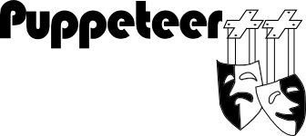

**Project status**: starting.

**Puppeteer++** is a video game intended to help students learn abstract programming concepts using C++, by representing them through metaphors with more colloquial concepts: a theater of puppets.

Learning theories, like constructivism and cognitivism, state learning is unavoidably performed by constructing new concepts through association with previous concepts. Students must learn abstract programming concepts, like memory segments and threads, associating them with... what? These are not concrete concepts; so, students cannot see or touch them to build concrete associations. Students must resort to imagination to have something to associate with. This is a rich scenery for creating wrong and weak associations. Therefore, it is not a surprise learning abstract programming concepts is considered as difficult task for computer science students worldwide.

We hypothesize representing abstract programming concepts with colloquial concepts that share similar properties, behaviors and relationships, and letting students play directly with them through a video game, can help students to construct associations and therefore, learn the abstract concepts. 

We surveyed our Computer Science students at Universidad de Costa Rica, asking them for the approximate usage percent of Java, C++ and other programming languages that we teach. In average, C++ was reported as the most used programming language. In fact, C++ is a mandatory for computer science students, but it is not intended for programming learning, therefore it normally becomes a daunting experience for students. We also asked for the most difficult and useful topics of C++. They revealed concurrent/parallel programming and memory management have the highest levels of both indicators: difficult to learn and useful.

Puppeteer++ is a video game where main abstract programming concepts of concurrent/parallel programming and memory management in C++ are illustrated by a puppet theatre metaphor. An execution thread is the puppeteer, a puppet is an object allocated in dynamic heap segment (the scenery), the puppeteer manages the puppet through a pointer represented by strings, and so on.

In this game the player (a C++ student) write the libretto for a theater play. The puppeteer follows this libretto literally. But puppeteers do not understand English or Spanish, they *do speak C++*...

Puppeteer++ is developed by Jeisson Hidalgo-Céspedes, under a research project of [Centro de Investigaciones en Tecnologías de la Información y Comunicación](http://www.citic.ucr.ac.cr/) (CITIC) of [Universidad de Costa Rica](http://www.ucr.ac.cr/). It is licensed under GPL v2. More information:

- [Game Design Document](doc/gdd/puppeteerpp.md)
- [API documentation](doc/api/)
- [Project oficial web page at CITIC](http://www.citic.ucr.ac.cr/proyecto/incentivo_lenguaje_programacion_en_estudiantes) (in Spanish)

Developers: Puppeteer++ is a multi-platform video game built over [Cocos2d-x](http://www.cocos2d-x.org/) v3. Instructions about setting up the development environment can be found in [BUILD.md](BUILD.md) file.
